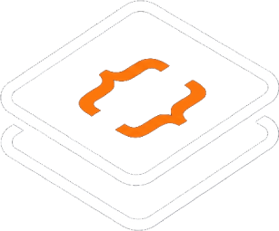

<p align="center">
  
</p>

<h1 align="center">DevDeck</h1>

<p align="center">
  <strong>A plataforma gamificada definitiva para desenvolvedores se conectarem, competirem e evoluírem.</strong>
</p>

<div align="center">

[](https://nextjs.org/)
[](https://www.typescriptlang.org/)
[](https://tailwindcss.com/)
[](https://www.prisma.io/)
[](https://supabase.com/)
[](LICENSE)

</div>

---

## ⚡ Conecte-se. Codifique. Conquiste.

O **DevDeck** transforma a interação social entre programadores em uma jornada interativa de aprendizado e diversão. Compartilhe suas dúvidas técnicas, ajude a comunidade, dispute duelos de código em tempo real e desbloqueie badges que provam sua senioridade (e senso de humor).

---

## 📖 Documentação do Projeto

Explore as especificações detalhadas do projeto e guias de infraestrutura:

* **[Guia de Contribuição](CONTRIBUTING.md):** Saiba como reportar bugs, sugerir melhorias e enviar Pull Requests.
* **[Arquitetura do Sistema](docs/ARCHITECTURE.md):** Visão geral da organização de diretórios, escolhas técnicas e fluxo de dados.
* **[Modelagem de Banco de Dados](docs/DATABASE.md):** Diagramas ER, indexações de Full-Text Search e dicionário de modelos.
* **[Guia de Implantação e Deploy](docs/DEPLOYMENT.md):** Passo a passo detalhado para colocar a plataforma em produção via Vercel e Supabase.

---

## 📌 Experiência do Usuário (Destaques)

<table width="100%">
  <tr>
    <td width="50%" valign="top">
      <h4>🎨 Design Twitter/X OLED Black</h4>
      <ul>
        <li>Interface super fluida com barra lateral completa (Página Inicial, Explorar, Notificações, Mensagens, Ducky, Itens Salvos e Perfil).</li>
        <li>Tema escuro nativo (OLED) para sessões de codificação noturnas saudáveis, configurável nas opções de Aparência.</li>
        <li>Visual mobile minimalista com bottom navigation bar.</li>
      </ul>
    </td>
    <td width="50%" valign="top">
      <h4>⚔️ Duelos de Código 1v1</h4>
      <ul>
        <li>Matchmaking dinâmico para disputas de algoritmo.</li>
        <li>Editor de código integrado alimentado por <b>CodeMirror</b>.</li>
        <li>Votação aberta para a comunidade escolher a melhor solução de forma justa.</li>
      </ul>
    </td>
  </tr>
  <tr>
    <td width="50%" valign="top">
      <h4>🎮 Motor de Gamificação</h4>
      <ul>
        <li>Trilhas de XP independentes para linguagens (TypeScript, Rust, Python, Go, C++, etc.).</li>
        <li>Contadores de ofensiva (Streaks) para incentivar a consistência diária.</li>
        <li><b>Quiz Diário</b> gerado por inteligência artificial a partir de postagens populares.</li>
      </ul>
    </td>
    <td width="50%" valign="top">
      <h4>🎖️ Badges Exclusivos</h4>
      <ul>
        <li>Insígnias meméticas com designs geométricos sofisticados (Hexágonos, Escudos, Anéis concêntricos) inspirados no Credly.</li>
        <li>Conquistas como <i>Sobrevivente do Segfault</i>, <i>Mago do TypeScript</i> e <i>Git Push --force</i>.</li>
      </ul>
    </td>
  </tr>
</table>

---

## 🛠️ Primeiros Passos (Instalação Rápida)

Para rodar o DevDeck na sua máquina local de forma simples e direta, siga os passos abaixo:

#### 1. Instalar as dependências do projeto
```bash
npm install
```

#### 2. Configurar o arquivo `.env.local`
Crie um arquivo chamado `.env.local` na raiz (copiando do `.env.example`) e configure com as conexões do seu banco de dados Supabase:
```env
DATABASE_URL="postgresql://..."
DIRECT_URL="postgresql://..."
NEXT_PUBLIC_SUPABASE_URL="https://..."
NEXT_PUBLIC_SUPABASE_ANON_KEY="..."
SUPABASE_SERVICE_ROLE_KEY="..."
```

#### 3. Sincronizar o Prisma e Popular o Banco (Seed)
```bash
# Gerar o cliente Prisma
npx prisma generate

# Executar as migrations no banco
npx prisma db push

# Inserir badges, trilhas, quizzes iniciais e usuários de teste
npx prisma db seed
```

#### 4. Executar o Servidor Local
```bash
npm run dev
```
Abra seu navegador em [http://localhost:3000](http://localhost:3000).

---

## 👥 Contas para Testes Rápidos

O seed cria três desenvolvedores com diferentes níveis de XP e trilhas de tecnologia. A senha dessas contas é definida por você no momento do seed através da variável de ambiente `SEED_DEFAULT_PASSWORD`.

> [!IMPORTANT]
> Defina `SEED_DEFAULT_PASSWORD` no seu `.env.local` **antes** de rodar `npx prisma db seed`.

| Nome | E-mail | Especialidade Principal |
| :--- | :--- | :--- |
| **Pedro** | `pedro@devdeck.dev` | TypeScript & JavaScript |
| **Ana** | `ana@devdeck.dev` | Python & Django |
| **Carlos** | `carlos@devdeck.dev` | Rust & C++ |

Acesse `/login` e utilize qualquer uma das contas acima com a senha que você configurou.

---

<p align="center">
  Desenvolvido com carinho para a comunidade dev. ☕✨
</p>
