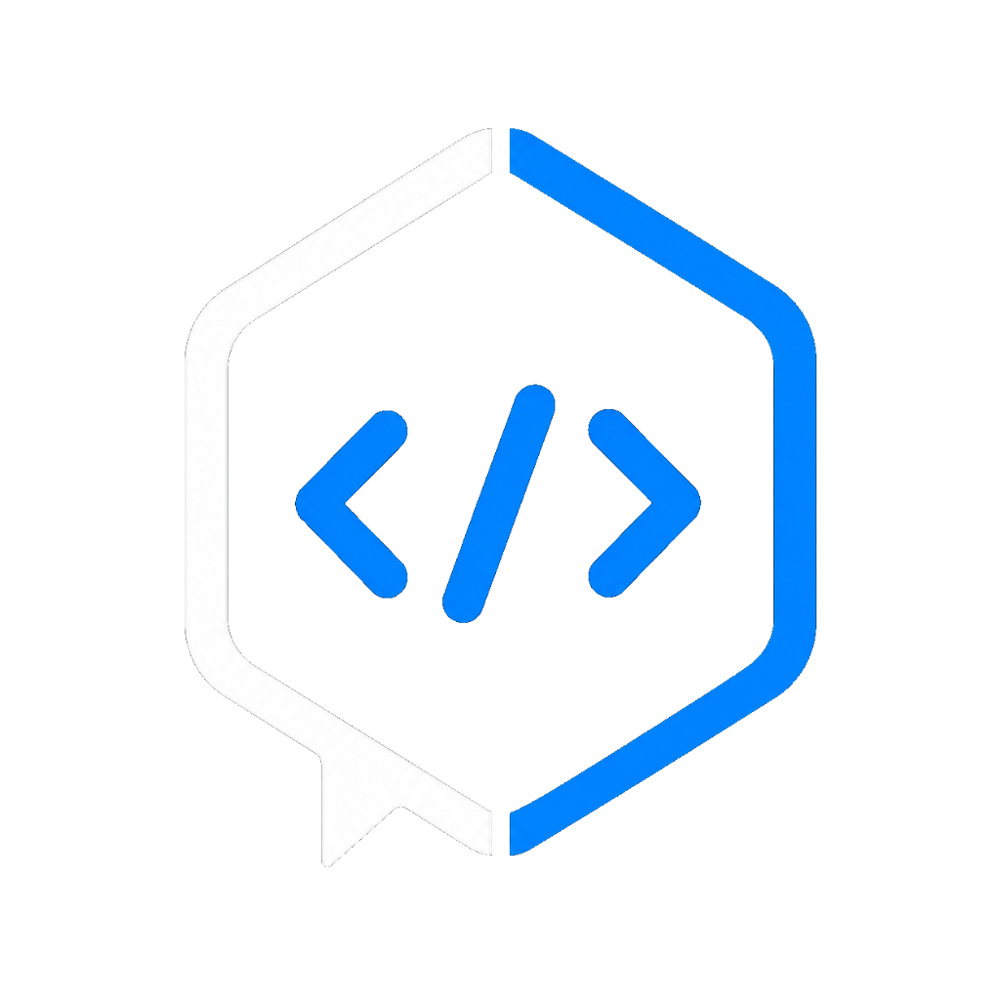

<p align="center">
  
</p>

<h1 align="center">Stacklyst</h1>

<p align="center">
  <strong>A plataforma gamificada definitiva para desenvolvedores se conectarem, competirem e evoluírem.</strong>
</p>

<div align="center">

[](https://nextjs.org/)
[](https://www.typescriptlang.org/)
[](https://tailwindcss.com/)
[](https://www.prisma.io/)
[](https://supabase.com/)
[](LICENSE)

</div>

---

## ⚡ Conecte-se. Codifique. Conquiste.

O **Stacklyst** transforma a interação social entre programadores em uma jornada interativa de aprendizado e diversão. Compartilhe suas dúvidas técnicas, ajude a comunidade, dispute duelos de código em tempo real e desbloqueie badges que provam sua senioridade (e senso de humor).

---

## 📖 Documentação do Projeto

Explore as especificações detalhadas do projeto e guias de infraestrutura:

- **[Guia de Contribuição](CONTRIBUTING.md):** Saiba como reportar bugs, sugerir melhorias e enviar Pull Requests.
- **[Arquitetura do Sistema](docs/ARCHITECTURE.md):** Visão geral da organização de diretórios, escolhas técnicas e fluxo de dados.
- **[Modelagem de Banco de Dados](docs/DATABASE.md):** Diagramas ER, indexações de Full-Text Search e dicionário de modelos.
- **[Guia de Implantação e Deploy](docs/DEPLOYMENT.md):** Passo a passo detalhado para colocar a plataforma em produção via Vercel e Supabase.

---

## 📌 Experiência do Usuário (Destaques)

<table width="100%">
  <tr>
    <td width="50%" valign="top">
      <h4>🎨 Design Twitter/X OLED Black & Electric Blue</h4>
      <ul>
        <li>Interface super fluida com a identidade visual <b>Electric Blue (#0083fe)</b> e barra lateral completa (Página Inicial, Explorar, Trilhas, ASYNC IA, Notificações, Mensagens e Perfil).</li>
        <li>Tema escuro nativo (OLED) para sessões de codificação noturnas saudáveis, configurável nas opções de Aparência.</li>
        <li>Visual mobile minimalista com bottom navigation bar.</li>
      </ul>
    </td>
    <td width="50%" valign="top">
      <h4>⚔️ Duelos de Código 1v1</h4>
      <ul>
        <li>Matchmaking dinâmico para disputas de algoritmo.</li>
        <li>Editor de código integrado alimentado por <b>CodeMirror</b>.</li>
        <li>Votação aberta para a comunidade escolher a melhor solução de forma justa.</li>
      </ul>
    </td>
  </tr>
  <tr>
    <td width="50%" valign="top">
      <h4>🎮 Motor de Gamificação</h4>
      <ul>
        <li>Trilhas de XP independentes para linguagens (TypeScript, Rust, Python, Go, C++, etc.).</li>
        <li>Contadores de ofensiva (Streaks) para incentivar a consistência diária.</li>
        <li><b>Quiz Diário</b> gerado por inteligência artificial a partir de postagens populares.</li>
      </ul>
    </td>
    <td width="50%" valign="top">
      <h4>🎖️ Badges Exclusivos</h4>
      <ul>
        <li>Insígnias meméticas com designs geométricos sofisticados (Hexágonos, Escudos, Anéis concêntricos) inspirados no Credly.</li>
        <li>Conquistas como <i>Sobrevivente do Segfault</i>, <i>Mago do TypeScript</i> e <i>Git Push --force</i>.</li>
      </ul>
    </td>
  </tr>
</table>

---

## 🐳 Rodar com Docker (Recomendado)

A forma mais simples de rodar o Stacklyst em **qualquer PC**. Você só precisa de [Docker](https://docs.docker.com/get-docker/) instalado.

#### 1. Clone o repositório

```bash
git clone https://github.com/pedrotescaro/Stacklyst.git
cd Stacklyst
git checkout develop
```

#### 2. Configure o ambiente

```bash
cp .env.docker.example .env.docker
```

Edite o `.env.docker` e preencha com suas credenciais do Supabase (obrigatório para login/registro). Se quiser apenas ver as páginas públicas, pode pular este passo.

#### 3. Suba os containers

```bash
# Modo desenvolvimento (com hot-reload)
docker compose up

# Modo produção (build otimizado)
docker compose -f docker-compose.prod.yml up --build -d
```

Abra [http://localhost:3000](http://localhost:3000) 🎉

> [!NOTE]
> O banco PostgreSQL é criado automaticamente no Docker. No primeiro start, o container instala dependências e roda migrations — pode levar 1-2 minutos.

> [!TIP]
> Para popular o banco com dados de teste (badges, quizzes, usuários), rode:
>
> ```bash
> docker compose exec web sh -c "npx prisma db seed"
> ```

---

## 🛠️ Primeiros Passos (Instalação Manual)

Se preferir rodar **sem Docker**, instale Node.js 20+ e PostgreSQL 15+ na sua máquina:

#### 1. Instalar as dependências do projeto

```bash
npm install
```

#### 2. Configurar o arquivo `.env.local`

Crie um arquivo chamado `.env.local` na raiz (copiando do `.env.example`) e configure com as conexões do seu banco de dados Supabase:

```env
DATABASE_URL="postgresql://..."
DIRECT_URL="postgresql://..."
NEXT_PUBLIC_SUPABASE_URL="https://..."
NEXT_PUBLIC_SUPABASE_PUBLISHABLE_KEY="sb_publishable_..."
SUPABASE_SECRET_KEY="sb_secret_..."
```

> A URL e a chave publishable habilitam o Supabase Auth, mas não substituem a
> conexão PostgreSQL. Registro, feed e demais dados do app exigem
> `DIRECT_URL` ou `DATABASE_URL`. A secret key é server-only e também é usada
> pelo seed e pelo fallback REST.

#### 3. Sincronizar o Prisma e Popular o Banco (Seed)

```bash
# Gerar o cliente Prisma
npx prisma generate

# Executar as migrations no banco
npx prisma db push

# Inserir badges, trilhas, quizzes iniciais e usuários de teste
npx prisma db seed
```

#### 4. Executar o Servidor Local

Antes de iniciar o Next.js, configure a ASYNC local conforme a seção abaixo.

```bash
npm run dev
```

Abra seu navegador em [http://localhost:3000](http://localhost:3000).

---

## 🧠 ASYNC local (Ollama + Qwen3 8B)

O frontend conversa somente com as API Routes do Stacklyst. O fluxo local é:

```text
Navegador → /api/ai/* → AI Service → Ollama → async → qwen3:8b
```

Instale o [Ollama](https://ollama.com/) e, em um terminal, baixe o modelo base e crie o modelo lógico do projeto:

```bash
ollama pull qwen3:8b
ollama create async -f Modelfile
```

Os mesmos comandos estão disponíveis como scripts:

```bash
npm run ai:pull
npm run ai:create
```

Inicie o servidor do Ollama em um terminal separado. Em instalações desktop ele pode já estar ativo em segundo plano:

```bash
ollama serve
```

Teste o modelo diretamente antes de iniciar a aplicação:

```bash
ollama run async
```

Configure `.env.local`:

```env
AI_PROVIDER="ollama"
STACKLYST_AI_URL="http://127.0.0.1:11434"
STACKLYST_AI_MODEL="async"
STACKLYST_AI_TIMEOUT_MS="60000"
STACKLYST_AI_REASONING="none"
GROQ_API_KEY=""
```

`STACKLYST_AI_REASONING="none"` reduz o tempo até a resposta no Qwen3. Use `low`, `medium` ou `high` apenas quando precisar de raciocínio mais profundo, pois esses modos aumentam a latência.

Para evitar que o modelo seja descarregado após cinco minutos de inatividade, configure `OLLAMA_KEEP_ALIVE=30m` no ambiente do processo do Ollama. Isso mantém o modelo em RAM e reduz a latência das próximas conversas, ao custo de reservar memória por mais tempo.

Depois execute:

```bash
npm run dev
```

Para validar a rota genérica pelo backend do Stacklyst:

```bash
curl -X POST http://localhost:3000/api/ai/chat \
  -H "Content-Type: application/json" \
  -d '{"messages":[{"role":"user","content":"Explique closures em JavaScript"}]}'
```

Para voltar temporariamente à Groq, não altere o frontend; configure somente:

```env
AI_PROVIDER="groq"
GROQ_API_KEY="sua-chave-server-only"
```

Em produção, especialmente na Vercel, `127.0.0.1` aponta para a própria instância da aplicação e não para seu computador. Hospede o Ollama em um servidor de inferência separado e defina exclusivamente no ambiente de produção, por exemplo:

```env
AI_PROVIDER="ollama"
STACKLYST_AI_URL="https://ai.stacklyst.com"
STACKLYST_AI_MODEL="async"
```

Não exponha o Ollama do computador de desenvolvimento à internet. `STACKLYST_AI_URL`, modelos, prompts e chaves são configurações server-only e nunca devem usar o prefixo `NEXT_PUBLIC_`.

### Requisitos locais

- O download e a criação inicial exigem espaço para o Qwen3 8B e acesso à internet.
- A velocidade e o consumo de memória dependem do hardware e da aceleração disponível.
- O chat e a análise de repositório preservam streaming; respostas estruturadas de quiz e desafio são validadas antes do uso.
- Se a IA falhar, quizzes e duelos mantêm os fallbacks já existentes no projeto.

---

## 🛠️ Desenvolvimento e Qualidade de Código

A plataforma possui ferramentas configuradas para garantir a padronização e a qualidade do código:

- **Typecheck:** Verifica os tipos TypeScript:
  ```bash
  npm run typecheck
  ```
- **Linter:** Analisa o código com ESLint para boas práticas:
  ```bash
  npm run lint
  ```
- **Format:** Formata o código automaticamente com Prettier (configuração de 2 espaços e aspas simples):
  ```bash
  npm run format
  ```
- **Testes (Vitest + Testing Library):**
  - Executar todos os testes uma única vez:
    ```bash
    npm test
    ```
  - Executar testes no modo watch:
    ```bash
    npm run test:watch
    ```

### ⚓ Hooks de Pré-commit (Husky + lint-staged)

O **Husky** está configurado junto com o **lint-staged** para rodar verificações automáticas antes de cada commit. Quando você faz `git commit`, os arquivos TypeScript e JavaScript modificados serão automaticamente validados pelo ESLint (`eslint --fix`) e formatados pelo Prettier (`prettier --write`). Se houver algum erro de sintaxe ou lint impeditivo, o commit será bloqueado até que o problema seja resolvido.

---

## 👥 Contas para Testes Rápidos

O seed cria três desenvolvedores com diferentes níveis de XP e trilhas de tecnologia. A senha dessas contas é definida por você no momento do seed através da variável de ambiente `SEED_DEFAULT_PASSWORD`.

> [!IMPORTANT]
> Defina `SEED_DEFAULT_PASSWORD` no seu `.env.local` **antes** de rodar `npx prisma db seed`.

| Nome       | E-mail                 | Especialidade Principal |
| :--------- | :--------------------- | :---------------------- |
| **Pedro**  | `pedro@stacklyst.dev`  | TypeScript & JavaScript |
| **Ana**    | `ana@stacklyst.dev`    | Python & Django         |
| **Carlos** | `carlos@stacklyst.dev` | Rust & C++              |

Acesse `/login` e utilize qualquer uma das contas acima com a senha que você configurou.

---

<p align="center">
  Desenvolvido com carinho para a comunidade dev. ☕✨
</p>
