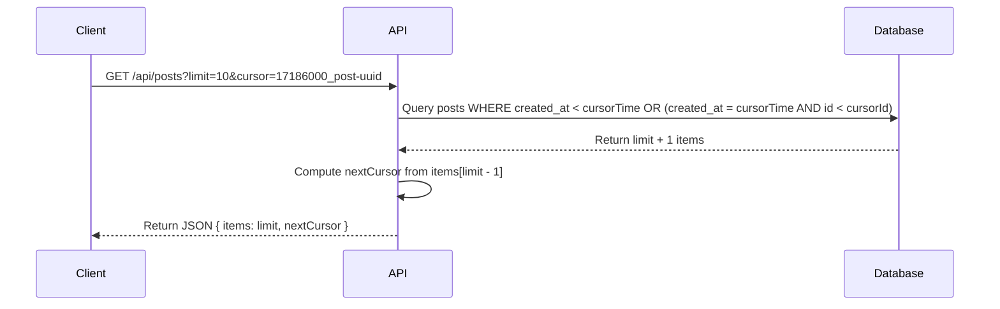
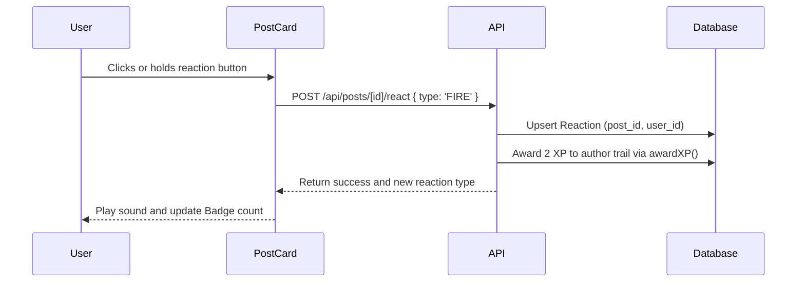

# Architecture — DevDeck

This document details the architecture, design choices, folder structure, and data flow of the DevDeck application.

---

## Technical Stack & Choices

1. **Next.js 16 (App Router):** The core framework. Uses Node.js runtime and Next.js 16's custom route protection via `src/proxy.ts` (exporting a custom `proxy` function) instead of the deprecated `middleware.ts`.
2. **Prisma ORM:** Database client used for schema modeling, seeding, and database transactions (e.g. atomic XP awards).
3. **Supabase (PostgreSQL):** Relational database hosting with native Full-Text Search (using `to_tsvector` and `plainto_tsquery` on a GIN index).
4. **Upstash Redis:** Distributed rate limiting for key API endpoints (`POST /api/posts`, `POST /api/messages`, `POST /api/auth/register`).
5. **OpenAI GPT-4o-mini:** Automated daily quiz generation with standard fallback to static DB quizzes.

---

## Folder Layout

```text
├── .github/
│   └── workflows/        # CI/CD and Daily Cron actions
├── docs/                 # Architecture, database and deployment docs
├── prisma/
│   ├── schema.prisma     # Relational database models
│   └── seed.ts           # Tech quizzes and system seed script
├── src/
│   ├── app/
│   │   ├── api/          # Keyset cursor pagination REST endpoints
│   │   ├── duels/        # Duels UI page components
│   │   ├── feed/         # Feed view with scroll-based pagination
│   │   ├── profile/      # User stats and post history
│   │   ├── globals.css   # Main styles, CSS variables and keyframes
│   │   ├── layout.tsx    # Root layout and theme provider wrapper
│   │   └── proxy.ts      # Next.js 16 custom Node-based route protection
│   ├── components/
│   │   ├── motion/       # Accessible accessible modals and button transitions
│   │   └── PostCard.tsx  # Unnested card view with custom reaction selector
│   ├── hooks/            # Custom reusable hooks (reduced motion, long press)
│   └── lib/
│       ├── auth.ts       # Supabase session parsing
│       ├── date.ts       # Centralized formatRelativeTime helper
│       ├── mentions.tsx  # Boundaries-safe @mention regex formatter
│       ├── ratelimit.ts  # Upstash Redis client with local fallbacks
│       └── xp.ts         # XP calculations and badges eligibility rules
```

---

## Key Data Flow

### 1. Keyset Cursor-Based Pagination

When fetching lists of posts, notifications, or user posts, the client sends a `limit` and an optional `cursor` (structured as `timestamp_id`):



### 2. Gamified User Reactions


