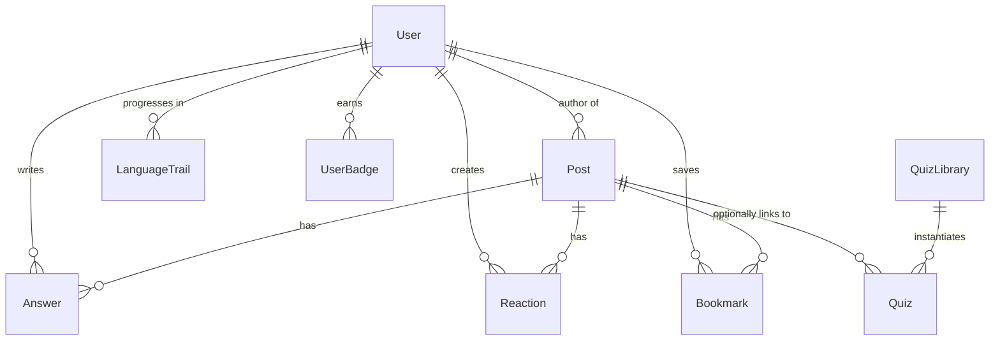

# Database Design & Indexes — DevDeck

DevDeck uses PostgreSQL hosted via Supabase, with schema synchronization and migrations managed by Prisma.

---

## Entity-Relationship Design



---

## Schema Models

### `User`
* Stores profile details, total XP, and active gamification streaks.
* **Fields:** `id` (UUID), `username` (Text), `avatar_url` (Text), `total_xp` (Int), `streak_days` (Int), `last_active_at` (DateTime).

### `Post`
* Stores user posts, programming language classification, and links to community quizzes.
* **Fields:** `id` (UUID), `author_id` (UUID), `title` (Text), `body` (Text), `language` (Enum), `code_snippet` (Text), `image_url` (Text), `is_pinned` (Boolean), `upvotes` (Int).

### `Reaction`
* Stores custom user reactions to posts.
* **Fields:** `id` (UUID), `post_id` (UUID), `user_id` (UUID), `type` (Enum: `FIRE`, `HEART`, `LAUGH`, `CLAP`, `BULB`), `created_at` (DateTime).
* **Indexes:** Unique index on `[post_id, user_id]`.

### `Bookmark`
* Saves user posts to bookmarks.
* **Fields:** `user_id` (UUID), `post_id` (UUID), `created_at` (DateTime).
* **Indexes:** Primary key on `[user_id, post_id]`.

### `QuizLibrary`
* Library of pre-configured tech quizzes used as fallbacks for daily quiz generation.
* **Fields:** `id` (UUID), `question` (Text), `options` (JSON Array), `correct_index` (Int), `tags` (Text Array).

---

## Indexing Strategy

1. **Foreign Key Indexes:** Created automatically by Prisma on all relation references (`post_id`, `user_id`, `author_id`) to accelerate `JOIN` queries.
2. **Reactions Unique Index:** `@@unique([post_id, user_id])` prevents duplicate reactions from a single user on any given post.
3. **Full-Text Search GIN Index:**
   To provide fast full-text searches inside the feed without expensive `LIKE %term%` queries, we use a GIN (Generalized Inverted Index) on a Portuguese language vector:
   ```sql
   CREATE INDEX IF NOT EXISTS "Post_fts_idx" ON "Post" USING gin(to_tsvector('portuguese', "title" || ' ' || "body"));
   ```
   * **Search query resolution:** Resolved in `/api/search` via a raw SQL query checking `@@ plainto_tsquery('portuguese', term)`.
